# Proyecto READ&SHARE

## Link Figma

https://www.figma.com/design/zT90Km5SHhE8oT0zsI0kQm/read-share?node-id=0-1&p=f&t=THDSOG1wODz7QQRJ-0

## Index

- [1. Introduction](#1-introduction)
- [2. Team](#2-team)
- [3. Strategy](#3-strategy)
- [4. Solutions Scope](#4-solutions-scope)
- [5. Benchmark](#5-benchmark)
- [6. Customer Journey Map](#6-customer-journey-map)
- [7. Navigation](#7-navigation)
- [8. Wireframes](#8-wireframes)
- [9. Mockups](#9-mockups)

---

## 1. Introduction

In response to the high cost of new books, the uncertainty of exchanging with strangers, and the pile of unused titles at home, we propose a web platform for trading physical books that connects readers (18+) within the same city. The platform helps people discover and obtain titles without buying them, broadens access to a wider variety of books, and strengthens the reading community through safe, reliable interactions.

Our value proposition blends convenience, safety, and community. Each user creates a Personal Catalog by scanning a book’s ISBN to auto fill title, author, and cover; manages a Wishlist that organizes and motivates reading; and gets alerts via a Match system when someone offers a wished for book or is interested in one they offer. To complete the journey, the site suggests secure exchange points (libraries, cafés, cultural centers) and sends automatic notifications so opportunities aren’t missed.

The UX project focuses on delivering a simple, fast, and trustworthy experience from search to meetup. We will measure success by the rate of completed matches, time to exchange, and user reported satisfaction. With this solution, we encourage reading habits, save money, and build community around books.

---

## 2. Team

Carlos Cienfuegos - Designer

Daniel Opazo - Project Manager & Presenter

Felipe Delgado - Designer

John Fernandez - Designer

Sebastian Romero - Analyst

---

## 3. Strategy

The first step under the Elements of User Experience is the Strategy plane, which focuses on incorporating not only what the people running the application want to get out of it but what the users want to get out of the application.

From this approach, a Value Proposition Canvas is used to determine what the people want to earn from our solution and how we are going to respond to those needs.

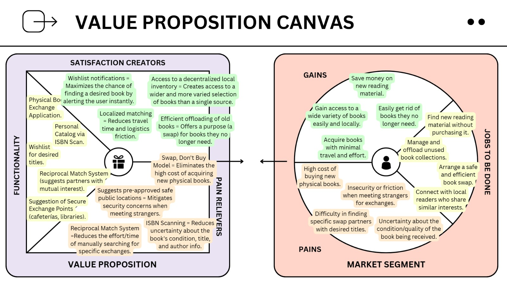

---

## 4. Solutions Scope

The READ&SHARE application is designed to solve the friction of finding new physical books without the commitment of purchasing them. Our solution focuses on providing a local, non-monetary, and secure exchange experience through its core features: the Reciprocal Match System, a Personal Catalog via ISBN Scan, a Wishlist, and the suggestion of Secure Exchange Points.

Our primary scope is the peer-to-peer book swap within a hyper-local area, eliminating the high costs and logistical friction associated with shipping and monetary transactions. The design is heavily informed by user pain points related to security and book condition.

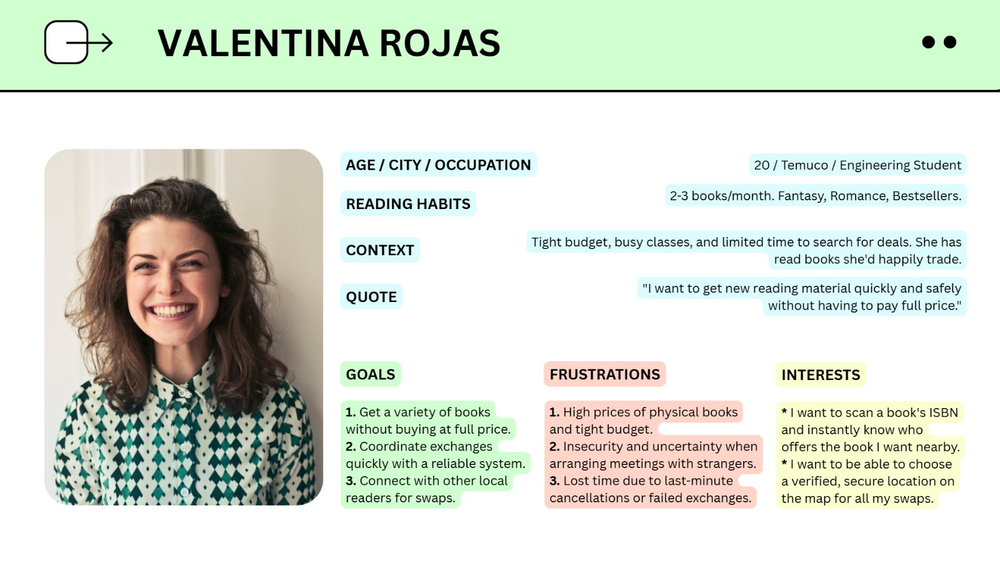

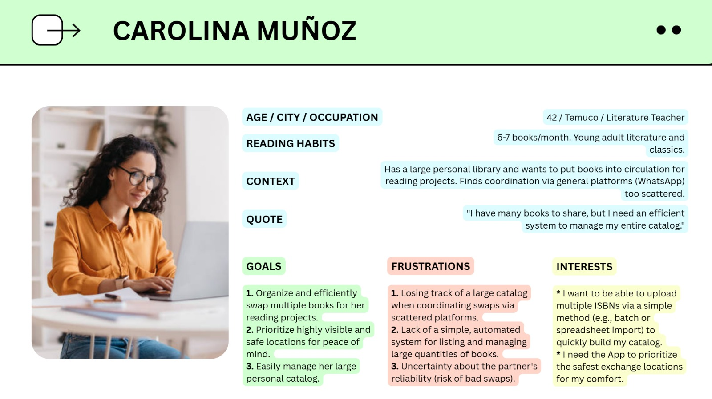

---

## 5. Benchmark

In order to develop an application that meets the expectations and needs of users, it is essential to carry out an exhaustive analysis of existing applications on the market, especially those that are direct competitors. This process, known as benchmarking, allows us to identify both the shortcomings and the positive aspects of these applications, in order to integrate them optimally into our own product.

By studying competing applications, we can learn from their mistakes and avoid repeating them in our application. In addition, we can identify successful features and functionalities that we can adopt and implement in our solution, thus providing a superior experience to our users.

Benchmarking analysis provides us with an objective perspective and helps us understand market expectations and user demands. By leveraging this information, we can design and develop an application that stands out from the competition and effectively meets the needs and aspirations of our users.

In short, benchmarking analysis allows us to recognize the strengths and weaknesses of competing applications, optimally integrating the positive aspects and avoiding the identified mistakes. This helps us to create an application that aligns with market expectations and delivers an exceptional user experience.

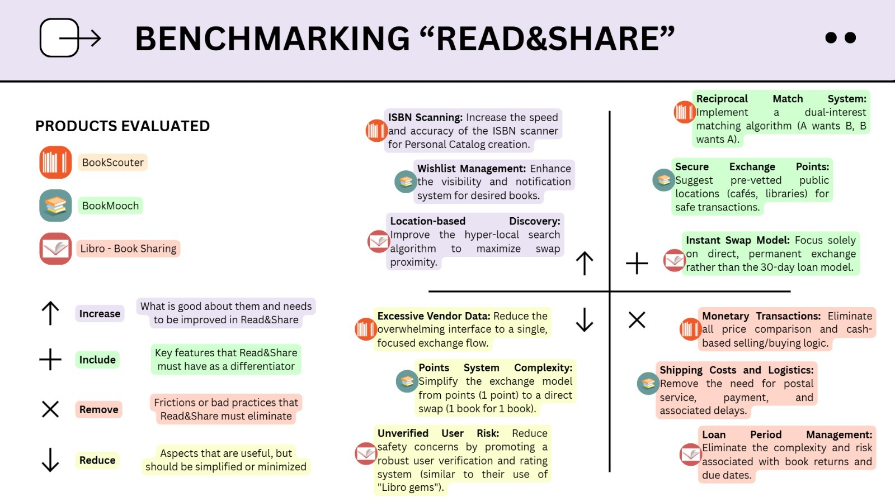

---

## 6. Customer Journey Map

The Customer Journey Map is a valuable tool to understand the user experience in their interaction with our product or service. Through the detailed mapping of each stage, from the first contact to the subsequent interaction, we can identify emotions, needs and critical moments. This analysis highlights challenges and opportunities to improve the experience and design exceptional solutions. By immersing ourselves in the user's world, we create memorable experiences and strengthen the relationship with them.

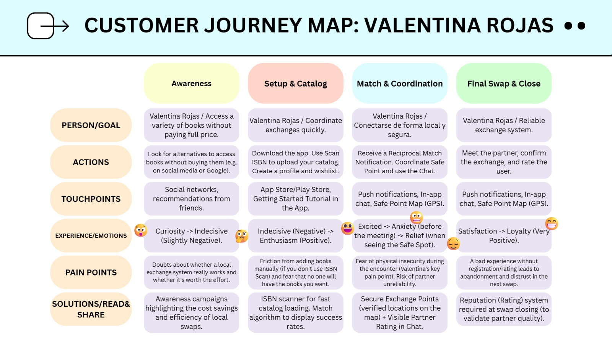

---

## 7. Navigation

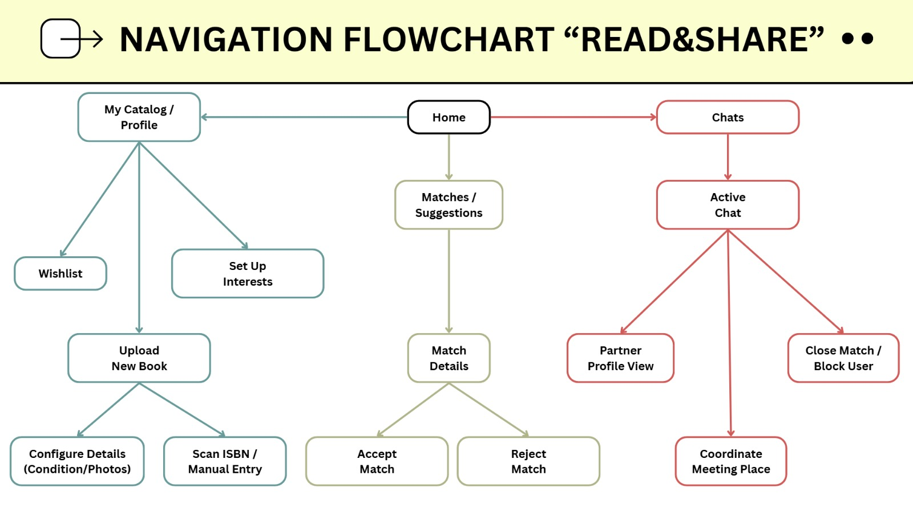

---

## 8. Wireframes

Wireframes are essential in design and development for several reasons. They provide a visual representation that helps plan and visualize the structure and layout of a product or website before investing significant resources. They serve as an efficient communication tool, facilitating discussions and aligning expectations among team members and stakeholders. They also support an iterative design process, allowing for quick experimentation and problem-solving while being cost-effective compared to high-fidelity prototypes. Lastly, wireframes promote user-centered design by prioritizing user needs and goals, resulting in more intuitive and efficient interfaces.

**Login**

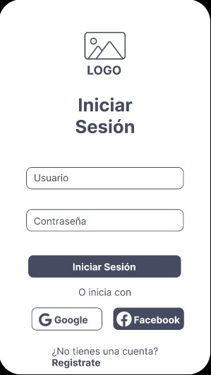

**Register**

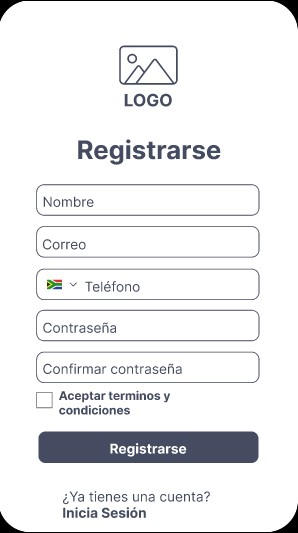

**Home**

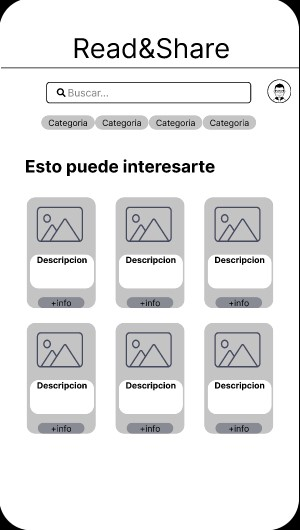

**See a book**

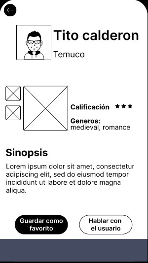

**Start a chat**

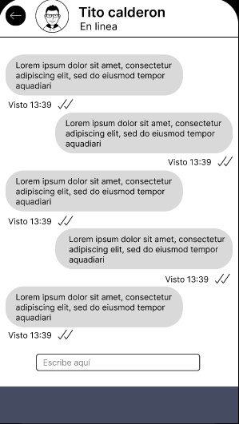

**Search a safe zone**

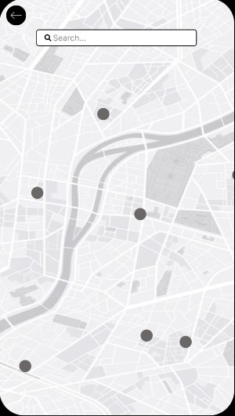

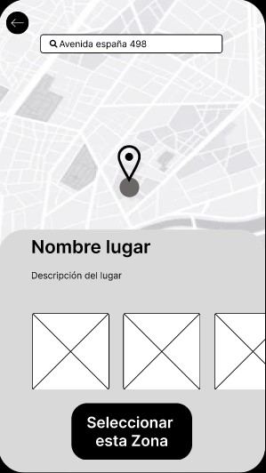

**Settings**

**Edit profile**

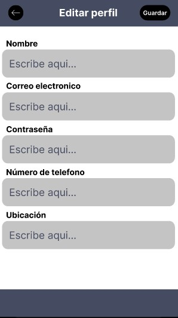

**Error**

---

## 9. Mockups

This section presents the High-Definition Mockups after a critical feedback process focused on aligning the design with the core value proposition: the Reciprocal Match System.

### 9.1. Initial Approach (Low-Fidelity Issues)

Initially, the wireframes contained incongruities, such as a **"Price" field** and a **generic "Search" bar** on the home screen. These were deficient because they contradicted the core non-monetary, reciprocal exchange model (Entregable 3). Furthermore, key functionality, such as the **ISBN Scan flow** and **Partner Rating visibility**, was missing (Entregables 6, 8, 10).

### 9.2. Improved Mockups (Final High-Fidelity Design)

The final design reflects the resolution of all strategic contradictions, validating the project's key differentiators:

| Evolution (Change from Initial to Final Design) | Justification (UCD Alignment) |
| :--- | :--- |
| **Home Screen:** Title changed to **"Matches Recíprocos"** and content prioritized to Reciprocal Swap Cards. | **Flowchart (8):** Eliminates the generic "Search" approach. **Scope (3):** Emphasizes the Reciprocal Match System (core feature). |
| **Book Detail/Swap View:** **Price field was removed.** Added fields for **Book Condition** and **Partner Rating**. | **Scope (3):** Affirms the **non-monetary model**. **UX Persona (Diego Pérez - 6):** Addresses the pain point of "Doubts about the actual condition of the book." |
| **Location Screen:** Renamed to **"Puntos de Intercambio Seguros"** and added security descriptors. | **CJM (9):** Directly addresses **Valentina's (Persona 1)** critical pain point: "Fear of physical insecurity" during the encounter. |
| **Profile View:** Updated to show **"Swaps Completados"** instead of "Lectores," and includes a dedicated link for **"Configurar Intereses/Géneros."** | **Scope (3):** Affirms the "Instant Swap Model." **Flowchart (8):** Validates the "Set Up Interests" node, which feeds the Match Algorithm. |

## 10. Heuristic evaluation's analysis

Following the development of the High-Fidelity Mockups, a **Heuristic Evaluation** was performed by the external team **Mindful Monkey**. The objective was to identify usability issues based on recognized principles (Nielsen's Heuristics) and calculate the product's perceived usability using the **System Usability Scale (SUS)**. This analysis explicitly informs the final refactoring and consolidation of the design.

### 10.1. Key Heuristic Findings

The evaluation identified **20 distinct usability problems**, consolidated into key areas of improvement:

* **Consistency and Standards:** The report highlighted severe inconsistencies in the **navigation bar alignment**, button styles (colors, borders, fonts), and typography across different views.
* **Match between System and Real World:** Terms used in the interface, such as "Lectores" (Readers) and "Publicados" (Published), did not accurately represent the business logic of a book exchange platform.
* **Visibility of System Status:** The Navbar was not consistently present in all views, failing to inform users of their current location within the system.
* **Error Prevention:** Critical actions, such as **deleting an account**, lacked a confirmation message or safety mechanism.

### 10.2. Criticality Assessment (TOP 5)

The severity and frequency of each issue were rated to calculate a **Critical Index (Severity x Frequency)**. The following table displays the top 5 most critical issues that required immediate refactoring:

| Rank | ID | Problem Description | Avg. Severity | Avg. Frequency | Critical Index |
| :--- | :--- | :--- | :--- | :--- | :--- |
| **1** | **20** | Absence of navigability/links to certain functions | 3.8 | 5.0 | **19.0** |
| **2** | **12** | Inconsistency in button styles (colors, borders, sizes) | 1.8 | 10.0 | **18.0** |
| **3** | **19** | Inconsistency in typographic fonts | 1.2 | 10.0 | **12.0** |
| **4** | **17** | Interaction ambiguity (Buttons vs. Static Indicators) | 2.2 | 4.0 | **8.8** |
| **5** | **9** | Navbar inconsistent presence and interference | 2.8 | 3.0 | **8.4** |

### 10.3. System Usability Scale (SUS) Results

The overall system satisfaction was measured using the SUS questionnaire. The scores indicated a critical need for improvement:

* **Average SUS Score:** **23 / 100**
* **Score Range:** From 10.0 (Lowest) to 35.0 (Highest).

*Interpretation:* An average score of 23 places the initial prototype in a low usability range, validating the need for the proposed refactor.

### 10.4. Refactoring Plan

Based on the "Mindful Monkey" proposals, the final version of the project implements:

1.  **Component Standardization:** Creation of a unified design system for buttons and typography to solve inconsistencies.
2.  **Navigation Overhaul:** Implementation of a consistent Navbar component across all views to ensure system status visibility.
3.  **Prototype Logic:** Correction of the prototype's navigability to ensure all flows (like "Upload Book" or "Interests") are connected and functional.
4.  **Term Alignment:** Renaming ambiguous labels to clearly reflect the exchange model (e.g., clarifying "Lectores" vs. "Swaps").

## 11. Final HI-FI's Refactor

This section presents the final iteration of the High-Fidelity design. These changes explicitly address the observations made by the **teaching team (Professor and Assistants)** during the feedback sessions, as well as the issues found in the heuristic analysis.

**Implemented Improvements:**

* **Visual Consistency (Colors & Fonts):** We established a unified color palette and standardized typography across all screens to resolve the inconsistencies found in buttons and text hierarchies.
* **Layout & Spacing:** Margins and padding were corrected to ensure a coherent layout and safe zones throughout the interface, improving aesthetic consistency.
* **Screen Flow:** The navigation logic was optimized to ensure a seamless flow between screens, adding missing connections to key functions.
* **Language Consistency:** Addressed the "Spanglish" issue identified in previous deliverables. The interface language has been unified to ensure a professional user experience.
* **Documentation Visibility:** Final mockups are now directly embedded in this README for immediate visualization, as requested.
* **Interactive Access:** The link to the functional prototype is now clearly available below.

### 11.1. Final Interface Screens

Below are the final High-Fidelity screens demonstrating the implementation of the feedback:
