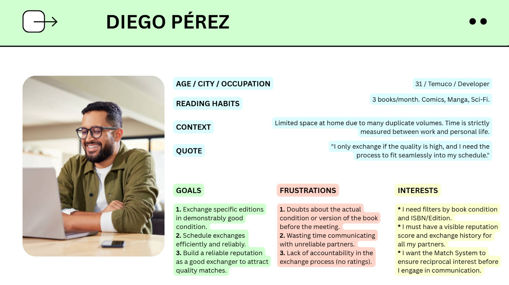
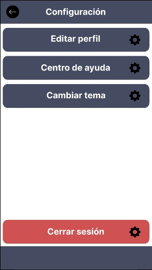

# Proyecto READ&SHARE

## Index

- [1. Introduction](#1-introduction)
- [2. Team](#2-team)
- [3. Strategy](#3-strategy)
- [4. Solutions Scope](#4-solutions-scope)
- [5. Benchmark](#5-benchmark)
- [6. Customer Journey Map](#6-customer-journey-map)
- [7. Navigation](#7-navigation)
- [8. Wireframes](#8-wireframes)
- [9. Mockups](#9-mockups)

---

## 1. Introduction

In response to the high cost of new books, the uncertainty of exchanging with strangers, and the pile of unused titles at home, we propose a web platform for trading physical books that connects readers (18+) within the same city. The platform helps people discover and obtain titles without buying them, broadens access to a wider variety of books, and strengthens the reading community through safe, reliable interactions.

Our value proposition blends convenience, safety, and community. Each user creates a Personal Catalog by scanning a book’s ISBN to auto fill title, author, and cover; manages a Wishlist that organizes and motivates reading; and gets alerts via a Match system when someone offers a wished for book or is interested in one they offer. To complete the journey, the site suggests secure exchange points (libraries, cafés, cultural centers) and sends automatic notifications so opportunities aren’t missed.

The UX project focuses on delivering a simple, fast, and trustworthy experience from search to meetup. We will measure success by the rate of completed matches, time to exchange, and user reported satisfaction. With this solution, we encourage reading habits, save money, and build community around books.

---

## 2. Team

Carlos Cienfuegos - Designer

Daniel Opazo - Project Manager & Presenter

Felipe Delgado - Designer

John Fernandez - Designer

Sebastian Romero - Analyst

---

## 3. Strategy

The first step under the Elements of User Experience is the Strategy plane, which focuses on incorporating not only what the people running the application want to get out of it but what the users want to get out of the application.

From this approach, a Value Proposition Canvas is used to determine what the people want to earn from our solution and how we are going to respond to those needs.

---

## 4. Solutions Scope

The READ&SHARE application is designed to solve the friction of finding new physical books without the commitment of purchasing them. Our solution focuses on providing a local, non-monetary, and secure exchange experience through its core features: the Reciprocal Match System, a Personal Catalog via ISBN Scan, a Wishlist, and the suggestion of Secure Exchange Points.

Our primary scope is the peer-to-peer book swap within a hyper-local area, eliminating the high costs and logistical friction associated with shipping and monetary transactions. The design is heavily informed by user pain points related to security and book condition.

---

## 5. Benchmark

In order to develop an application that meets the expectations and needs of users, it is essential to carry out an exhaustive analysis of existing applications on the market, especially those that are direct competitors. This process, known as benchmarking, allows us to identify both the shortcomings and the positive aspects of these applications, in order to integrate them optimally into our own product.

By studying competing applications, we can learn from their mistakes and avoid repeating them in our application. In addition, we can identify successful features and functionalities that we can adopt and implement in our solution, thus providing a superior experience to our users.

Benchmarking analysis provides us with an objective perspective and helps us understand market expectations and user demands. By leveraging this information, we can design and develop an application that stands out from the competition and effectively meets the needs and aspirations of our users.

In short, benchmarking analysis allows us to recognize the strengths and weaknesses of competing applications, optimally integrating the positive aspects and avoiding the identified mistakes. This helps us to create an application that aligns with market expectations and delivers an exceptional user experience.

---

## 6. Customer Journey Map

The Customer Journey Map is a valuable tool to understand the user experience in their interaction with our product or service. Through the detailed mapping of each stage, from the first contact to the subsequent interaction, we can identify emotions, needs and critical moments. This analysis highlights challenges and opportunities to improve the experience and design exceptional solutions. By immersing ourselves in the user's world, we create memorable experiences and strengthen the relationship with them.

---

## 7. Navigation

---

## 8. Wireframes

Wireframes are essential in design and development for several reasons. They provide a visual representation that helps plan and visualize the structure and layout of a product or website before investing significant resources. They serve as an efficient communication tool, facilitating discussions and aligning expectations among team members and stakeholders. They also support an iterative design process, allowing for quick experimentation and problem-solving while being cost-effective compared to high-fidelity prototypes. Lastly, wireframes promote user-centered design by prioritizing user needs and goals, resulting in more intuitive and efficient interfaces.

**Login**

**Register**

**Home**

**See a book**

**Start a chat**

**Search a safe zone**

**Settings**

**Edit profile**

**Error**

---

## 9. Mockups

This section presents the High-Definition Mockups after a critical feedback process focused on aligning the design with the core value proposition: the Reciprocal Match System.

### 9.1. Initial Approach (Low-Fidelity Issues)

Initially, the wireframes contained incongruities, such as a **"Price" field** and a **generic "Search" bar** on the home screen. These were deficient because they contradicted the core non-monetary, reciprocal exchange model (Entregable 3). Furthermore, key functionality, such as the **ISBN Scan flow** and **Partner Rating visibility**, was missing (Entregables 6, 8, 10).

### 9.2. Improved Mockups (Final High-Fidelity Design)

The final design reflects the resolution of all strategic contradictions, validating the project's key differentiators:

| Evolution (Change from Initial to Final Design) | Justification (UCD Alignment) |
| :--- | :--- |
| **Home Screen:** Title changed to **"Matches Recíprocos"** and content prioritized to Reciprocal Swap Cards. | **Flowchart (8):** Eliminates the generic "Search" approach. **Scope (3):** Emphasizes the Reciprocal Match System (core feature). |
| **Book Detail/Swap View:** **Price field was removed.** Added fields for **Book Condition** and **Partner Rating**. | **Scope (3):** Affirms the **non-monetary model**. **UX Persona (Diego Pérez - 6):** Addresses the pain point of "Doubts about the actual condition of the book." |
| **Location Screen:** Renamed to **"Puntos de Intercambio Seguros"** and added security descriptors. | **CJM (9):** Directly addresses **Valentina's (Persona 1)** critical pain point: "Fear of physical insecurity" during the encounter. |
| **Profile View:** Updated to show **"Swaps Completados"** instead of "Lectores," and includes a dedicated link for **"Configurar Intereses/Géneros."** | **Scope (3):** Affirms the "Instant Swap Model." **Flowchart (8):** Validates the "Set Up Interests" node, which feeds the Match Algorithm. |